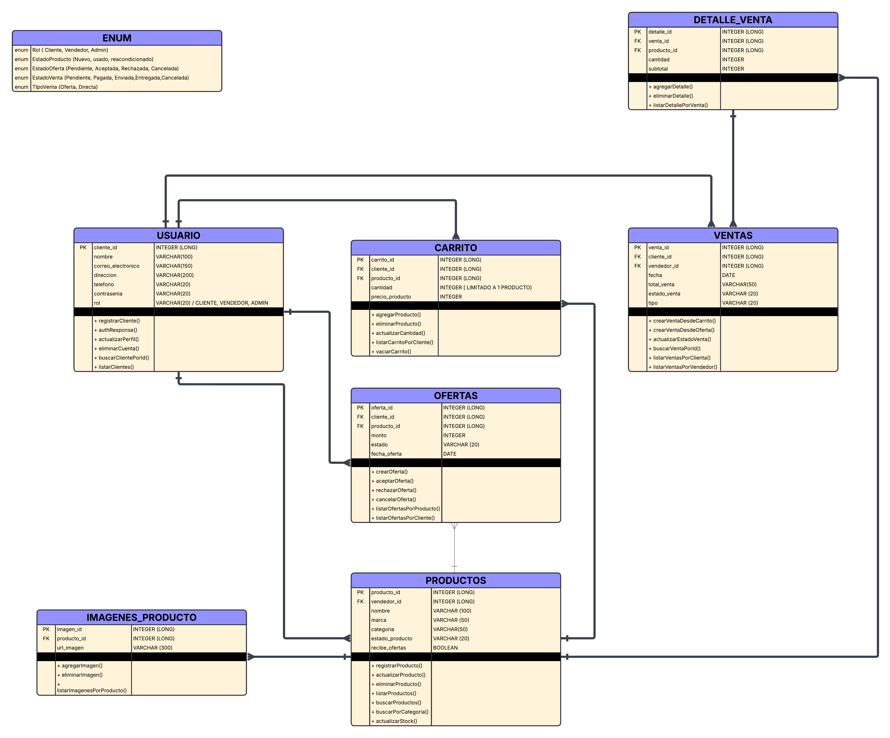

# **Documentación Backend – Proyecto Bargaming**

---

## **Tecnologías principales**

- **Java 17+**
- **Spring Boot** (Maven)
- **JPA / Hibernate** con **Oracle Database**
- **REST API** con formato **JSON**
- **Spring Security (JWT)** para autenticación y roles
- Arquitectura modular (`modules/` + `common/`)

---

## **Estructura general de módulos**

1. **Auth & Usuarios (`auth`)**
   Registro, login y control de roles (**CLIENTE**, **VENDEDOR**, **ADMIN**).
2. **Productos (`products`)**
   Publicación, edición y gestión de productos e imágenes.
3. **Carrito (`cart`)**
   Administración del carrito de compras por cliente.
4. **Ventas (`ventas`)**
   Registro de compras, detalle de productos y estado de venta.
5. **Administrador (`admin`)**
   Control de usuarios y monitoreo general del sistema.

---

## **1. Autenticación y Usuarios (`auth`)**

Módulo encargado de registrar usuarios, iniciar sesión y gestionar accesos por rol.

### **Endpoints principales**

| Método   | Ruta                 | Descripción                                        | Rol      |
| -------- | -------------------- | -------------------------------------------------- | -------- |
| **POST** | `/api/auth/register` | Registrar nuevo usuario (rol por defecto: CLIENTE) | Público  |
| **POST** | `/api/auth/login`    | Iniciar sesión y obtener token JWT                 | Público  |
| **GET**  | `/api/client/demo`   | Prueba de acceso CLIENTE                           | CLIENTE  |
| **GET**  | `/api/seller/demo`   | Prueba de acceso VENDEDOR                          | VENDEDOR |
| **GET**  | `/api/admin/demo`    | Prueba de acceso ADMIN                             | ADMIN    |
| **GET**  | `/api/admin/users`   | Listar todos los usuarios registrados              | ADMIN    |

> Los usuarios con **rol ADMIN** se crean manualmente o mediante inicialización de datos.
> Los nuevos registros obtienen el **rol CLIENTE por defecto**.

---

## **2. Productos (`products`)**

Módulo responsable de la gestión de productos publicados por vendedores y las imágenes asociadas.

### **Endpoints**

| Método     | Ruta                           | Descripción                                              | Rol      |
| ---------- | ------------------------------ | -------------------------------------------------------- | -------- |
| **POST**   | `/api/productos`               | Crear nuevo producto                                     | VENDEDOR |
| **GET**    | `/api/productos`               | Listar productos (filtros por categoría, marca o nombre) | Público  |
| **GET**    | `/api/productos/{id}`          | Ver detalle de un producto                               | Público  |
| **PUT**    | `/api/productos/{id}`          | Editar producto                                          | VENDEDOR |
| **DELETE** | `/api/productos/{id}`          | Eliminar producto                                        | VENDEDOR |
| **POST**   | `/api/productos/{id}/imagenes` | Subir imagen al producto                                 | VENDEDOR |
| **GET**    | `/api/productos/{id}/imagenes` | Listar imágenes asociadas                                | Público  |

---

## **3. Carrito (`cart`)**

Módulo para manejar el carrito temporal de un cliente.

### **Endpoints**

| Método     | Ruta                                                       | Descripción                        | Rol     |
| ---------- | ---------------------------------------------------------- | ---------------------------------- | ------- |
| **GET**    | `/api/carrito/{clienteId}`                                 | Ver contenido del carrito          | CLIENTE |
| **POST**   | `/api/carrito/{clienteId}/agregar/{productoId}?cantidad=1` | Agregar producto al carrito        | CLIENTE |
| **PUT**    | `/api/carrito/{cartId}?cantidad=5`                         | Actualizar cantidad de un producto | CLIENTE |
| **DELETE** | `/api/carrito/item/{cartId}`                               | Quitar producto del carrito        | CLIENTE |
| **DELETE** | `/api/carrito/{clienteId}/vaciar`                          | Vaciar carrito completo            | CLIENTE |

---

## **4. Ventas (`ventas`)**

Maneja las compras directas realizadas desde el carrito y el seguimiento de su estado.

### **Endpoints**

| Método   | Ruta                                     | Descripción                                                        | Rol                |
| -------- | ---------------------------------------- | ------------------------------------------------------------------ | ------------------ |
| **POST** | `/api/ventas/{clienteId}`                | Registrar venta desde el carrito                                   | CLIENTE            |
| **GET**  | `/api/ventas/cliente/{idCliente}`        | Listar compras de un cliente                                       | CLIENTE            |
| **GET**  | `/api/ventas/vendedor/{idVendedor}`      | Listar ventas de un vendedor                                       | VENDEDOR           |
| **GET**  | `/api/ventas/{id}/detalle`               | Ver detalle de una venta                                           | CLIENTE / VENDEDOR |
| **PUT**  | `/api/ventas/{id}/estado?estado=ENVIADA` | Actualizar estado de venta (PAGADA, ENVIADA, ENTREGADA, CANCELADA) | VENDEDOR / ADMIN   |

---

## **5. Administración (`admin`)**

Gestión general del sistema, usuarios y monitoreo.

### **Endpoints**

| Método     | Ruta                    | Descripción                           | Rol   |
| ---------- | ----------------------- | ------------------------------------- | ----- |
| **GET**    | `/api/admin/users`      | Listar todos los usuarios registrados | ADMIN |
| **DELETE** | `/api/admin/users/{id}` | Eliminar usuario del sistema          | ADMIN |

---

## **Flujo principal de negocio**

1. **Publicación:**
   El vendedor publica un producto mediante `POST /api/productos`.

2. **Compra directa:**
   El cliente agrega productos al carrito y genera la venta con `POST /api/ventas/{clienteId}`.

3. **Pago confirmado:**
   Se marca la venta como `PAGADA`.

4. **Actualización de estado:**
   El vendedor o administrador puede cambiar el estado (`ENVIADA`, `ENTREGADA`, `CANCELADA`) usando `PUT /api/ventas/{id}/estado`.

---

## **Roles y permisos**

| Rol          | Acceso                                           |
| ------------ | ------------------------------------------------ |
| **CLIENTE**  | Navegar, agregar al carrito, comprar productos   |
| **VENDEDOR** | Publicar y administrar productos, revisar ventas |
| **ADMIN**    | Control total del sistema, usuarios y ventas     |

---

## **Diagrama ERD**

| Módulo              | Estado                                       |
| ------------------- | -------------------------------------------- |
| **Auth / Usuarios** | Completo y funcional                         |
| **Productos**       | Completo y funcional                         |
| **Carrito**         | Completo y funcional                         |
| **Ventas**          | Completo y funcional                         |
| **Administrador**   | Completo (listado y eliminación de usuarios) |
| **Ofertas**         | No implementado (no requerido)               |
